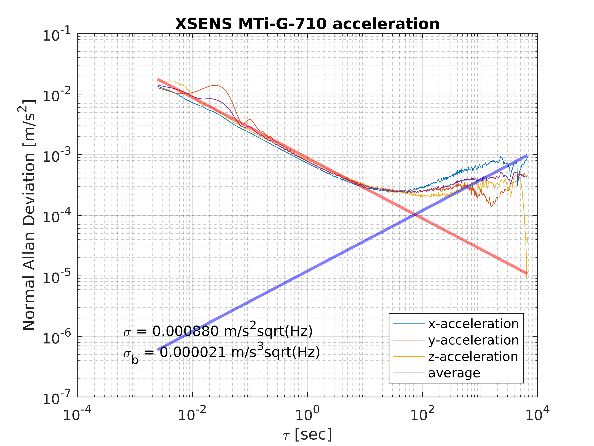
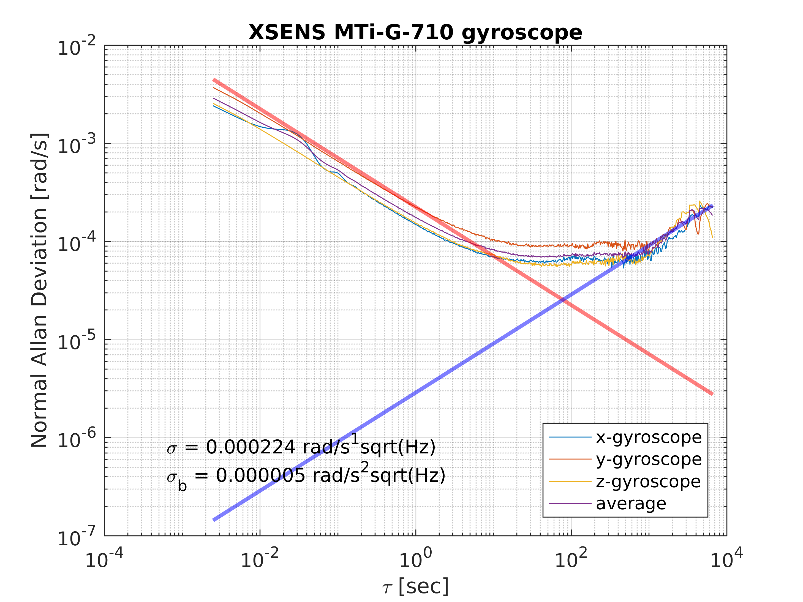
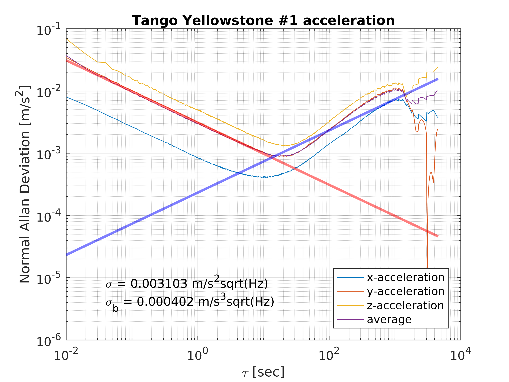
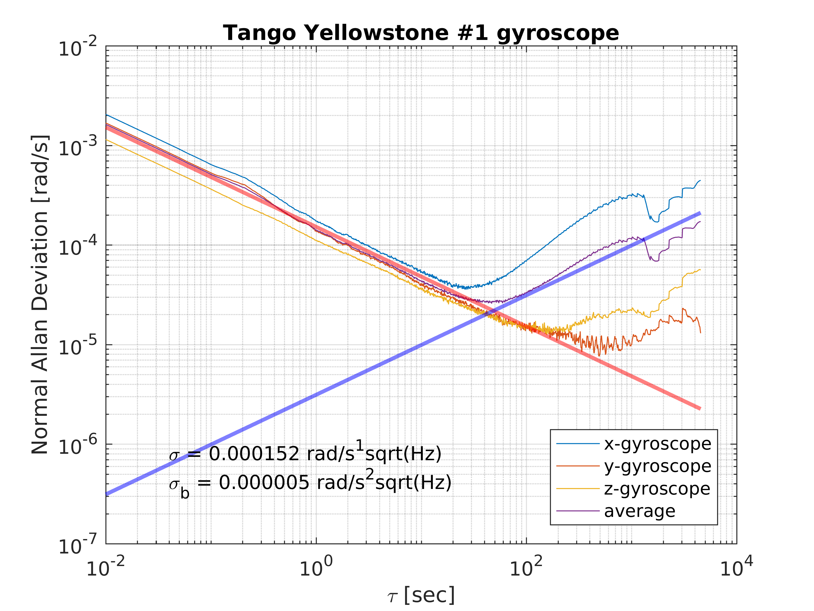
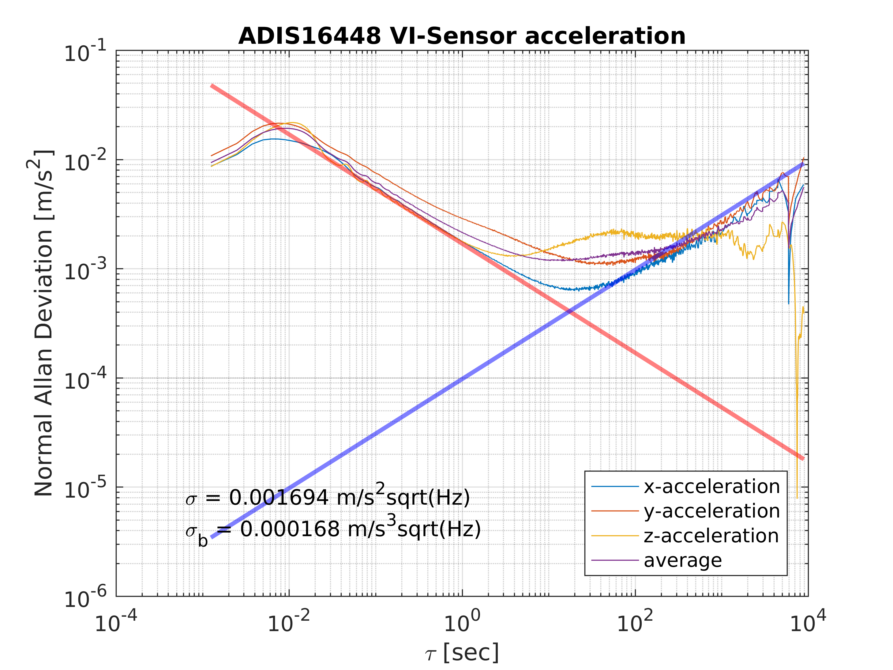
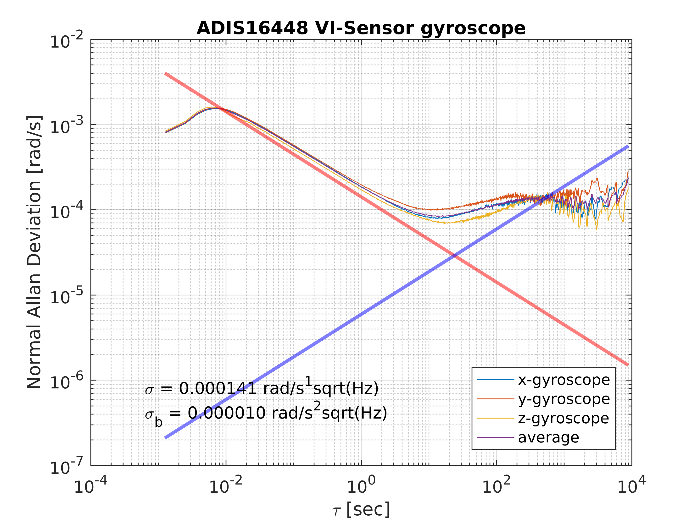

# kalibr_allan_ros2

This is a ROS2 version of kalibr_allan.

### Prerequisites

- **System**

  - Ubuntu 22.04

  - ROS2 humble

- **Libraries**

  - boost
  - Eigen
  - matlab

### build

```shell
cd ${PATH_TO_YOUR_ROS2_WS}/src
git clone https://github.com/LSXiang/kalibr_allan_ros2.git
cd ..
source /opt/ros/$ROS_DISTRO/setup.bash
colcon build --symlink-install && source ./install/local_setup.bash
```

### Convert the ROS bag into a matlab mat file

- Example: `ros2 run bagconvert bagconvert imu.bag /imu0`


<br><br><br>

---

## Original Readme

This has some nice utility scripts and packages that allow for calculation of the noise values for use in both [kalibr](https://github.com/ethz-asl/kalibr) and IMU filters.
The dataset of the manufacture can find the "white noise" values for the system, but the bias noises need to be found through experimental tests.
The `gyroscope_random_walk` and `accelerometer_random_walk` values can normally be found on the IMU datasheet as either angular random walk or velocity random walk, respectively.


### IMU Noise Values

Parameter | YAML element | Symbol | Units
--- | --- | --- | ---
Gyroscope "white noise" | `gyroscope_noise_density` |  | 
Accelerometer "white noise" | `accelerometer_noise_density` |  | 
Gyroscope "random walk" | `gyroscope_random_walk` |  | 
Accelerometer "random walk" | `accelerometer_random_walk` |  | 


### Experiment Steps

1. With the IMU remaining still, record a ROS bag of the readings (we collected a bag for about 4 hours)
2. Convert the ROS bag into a matlab mat file.
    * Use the included `bagconvert` ROS package to do this
    * Example: `rosrun bagconvert bagconvert imu.bag /imu0`
3. Run the included matlab scripts to generate an allan deviation plot for the readings
    * If using the parallel version, it uses the matlab parallel toolbox
    * Need to specify the mat file that the bagconverter made, and the rate of IMU messages
4. Interpret the generated charts to find noise values
    * Run the process results script
    * Will fit a -1/2 line to the left side of the allan plot
    * White noise is at tau=1 (according to [kalibr wiki](https://github.com/ethz-asl/kalibr/wiki/IMU-Noise-Model#from-the-allan-standard-deviation-ad))
    * Will fit a 1/2 line to the right side of the allan plot
    * Random walk is at tau=3 (according to [kalibr wiki](https://github.com/ethz-asl/kalibr/wiki/IMU-Noise-Model#from-the-allan-standard-deviation-ad))
5. Some example data can be found **[HERE](https://drive.google.com/drive/folders/1a3Es85JDKl7tSpVWEUZryOwtsXB8793o?usp=sharing)**:
    * XSENS MTI-G-700
    * Tango Yellowstone Tablet
    * ASL-ETH VI-Sensor

#### Example Plot - XSENS MTI-G-700

 


#### Example Plot - Tango Yellowstone Tablet

 


#### Example Plot - ASL-ETH VI-Sensor



